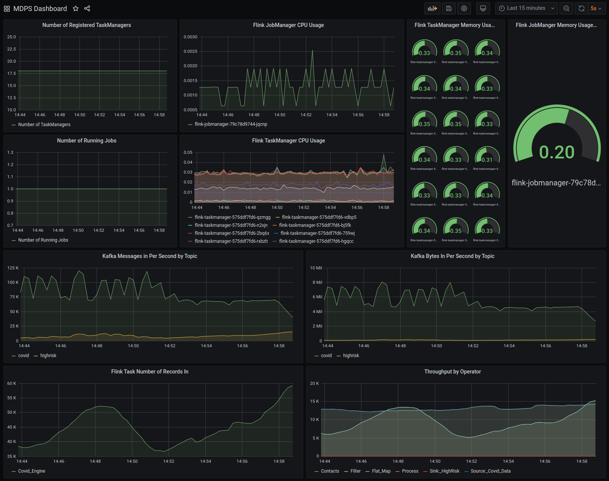
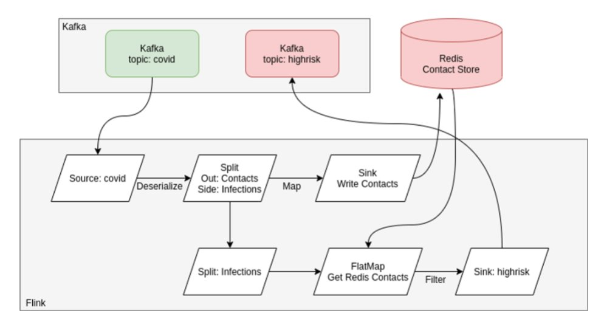

# Setting up the infrastructure

The Docker images and Helm charts can be deployed on any Kubernetes Cluster. In this case, the infrastructure was setup
through the Google Kubernetes Engine (GKE). However, if the Kubernetes Cluster was set up on any other cloud provider or
on-premise, the Helm charts can be used to do the deployments of the application components.

## Prerequisites

* Install Terraform (see https://learn.hashicorp.com/tutorials/terraform/install-cli?in=terraform/gcp-get-started)
* Install the gcloud sdk (see https://cloud.google.com/sdk) in case the gcp commands are executed from the local machine
  instead of using Google Cloud Shell

## GKE cluster setup

_Skip this section if there is already an existent Kubernetes Cluster_

Run `make cluster-create` to create a cluster.

In order to destroy it, run `make cluster-destroy`.

## Deploying the applications

Simply, run `make services-install`.

### Deploying Hadoop for HDFS manually

Run `make hdfs-install`.

### Deploying Kafka, Prometheus, Grafana, and Redis manually

Kafka, Prometheus, Redis, and Grafana can be deployed on a Kubernetes cluster using the Helm charts located in the `infrastructure/k8s/helm` directory. Configure which charts to deploy in the global values.yaml by setting enabled: true for each desired technology. Cluster sizes and ports for external access can also be specified here.
Each subchart can be deployed by itself and contains its own values.yaml file with futher configurations. If deployed from the umbrella chart, values in the global values.yaml will overwrite the values in the subchart's values.yaml.

Deploy the charts with:
```
helm install [DEPLOYMENT NAME] [CHART DIRECTORY]
```

#### Grafana: additional notes

Get the Grafana URL to visit by running these commands in the same shell:

```
NODE_PORT=$(kubectl get --namespace default -o jsonpath="{.spec.ports[0].nodePort}" services grafana)
NODE_IP=$(kubectl get nodes -o jsonpath='{.items[0].status.addresses[?(@.type=="ExternalIP")].address}')
echo http://$NODE_IP:$NODE_PORT
```

##### Viewing metrics in Grafana

<p align="center">
  
</p>

Grafana is accessible at <kubernetes_node_ip>:<nodeport>.
The default nodeport is ``30080`` and the default username and password is ``admin``

After logging into Grafana, the data source must be added.
Navigate to: ``Configuration > Data Sources > Add data source > Prometheus``
Set the Url to ``prometheus:9090`` and click save and test. You should see a green notification that the data source is working.

To import the premade grafana dashboard to show metrics, navigate to:
``Create > Import > Upload JSON file``
Upload the ``grafana-dashboard.json`` file from the root directory.


### Deploying native Kubernetes Apache Flink manually

Create clusterrolebinding on Kubernetes for Flink
```
$ kubectl create clusterrolebinding flink-role-binding-default --clusterrole=edit --serviceaccount=default:default
```


If you do not want to use the default service account, use the following command to create a new flink-service-account service account and set the role binding. 
Then use the config option `-Dkubernetes.service-account=flink-service-account` to make the JobManager pod use the flink-service-account service account to create/delete TaskManager pods and leader ConfigMaps. 
Also this will allow the TaskManager to watch leader ConfigMaps to retrieve the address of JobManager and ResourceManager.
```
$ kubectl create serviceaccount flink-service-account
$ kubectl create clusterrolebinding flink-role-binding-flink --clusterrole=edit --serviceaccount=default:flink-service-account
```

##### Deploy the Flink cluster using the cli from the downloaded Flink package
A Flink native Kubernetes cluster in session mode could be deployed like this:
```
./bin/kubernetes-session.sh \
    -Dkubernetes.cluster-id=flink-cluster \
    -Dkubernetes.container.image=eu.gcr.io/mpds-task-orange/covid-engine:2.3.1 \
    -Dkubernetes.container.image.pull-policy=Always \
    -Dexecution.attached=true \
    -Dkubernetes.jobmanager.annotations=prometheus.io/scrape:'true',prometheus.io/port:'9999' \
    -Dkubernetes.taskmanager.annotations=prometheus.io/scrape:'true',prometheus.io/port:'9999' \
    -Dmetrics.latency.granularity=OPERATOR \
    -Dmetrics.latency.interval=1000 \
    -Dmetrics.reporters=prom \
    -Dmetrics.reporter.prom.class=org.apache.flink.metrics.prometheus.PrometheusReporter \
    -Dmetrics.reporter.prom.port=9999 \
    -Dmetrics.reporter.jmx.class=org.apache.flink.metrics.jmx.JMXReporter \
    -Dmetrics.reporter.jmx.port=8789 \
    -Dstate.savepoints.dir=hdfs://hadoop-hdfs-namenode:8020/flink/savepoints
```

Or like this using the custom service account:
```
./bin/kubernetes-session.sh \
	-Dkubernetes.service-account=flink-service-account \
	-Dkubernetes.cluster-id=flink-cluster \
	-Dkubernetes.container.image=eu.gcr.io/mpds-task-orange/covid-engine:2.3.1 \
	-Dkubernetes.container.image.pull-policy=Always \
	-Dexecution.attached=true \
	-Dkubernetes.jobmanager.annotations=prometheus.io/scrape:'true',prometheus.io/port:'9999' \
	-Dkubernetes.taskmanager.annotations=prometheus.io/scrape:'true',prometheus.io/port:'9999' \
	-Dmetrics.latency.granularity=OPERATOR \
	-Dmetrics.latency.interval=1000 \
	-Dmetrics.reporters=prom \
	-Dmetrics.reporter.prom.class=org.apache.flink.metrics.prometheus.PrometheusReporter \
	-Dmetrics.reporter.prom.port=9999 \
	-Dmetrics.reporter.jmx.class=org.apache.flink.metrics.jmx.JMXReporter \
	-Dmetrics.reporter.jmx.port=8789 \
	-Dstate.savepoints.dir=hdfs://hadoop-hdfs-namenode:8020/flink/savepoints
```

Get the Flink Web UI URL:

```
NODE_PORT=$(kubectl get --namespace default -o jsonpath="{.spec.ports[0].nodePort}" services flink-cluster-rest)
NODE_IP=$(kubectl get nodes -o jsonpath='{.items[0].status.addresses[?(@.type=="ExternalIP")].address}')
echo http://$NODE_IP:$NODE_PORT
```

Submit the Flink job and start the application, e.g.:

- Parallelism: `1`
- Program Arguments: `--statebackend.default false --checkpoint hdfs://hadoop-hdfs-namenode:8020/flink/checkpoints --checkpoint.interval 600000`
- Savepoint Path: `hdfs://hadoop-hdfs-namenode:8020/flink/savepoints/savepoint-040a83-73e0bac50483`

## Flink DSP Engine

<p align="center">
  
</p>


## Removal & Cleanup
Manual Resource Cleanup for FLink
```
kubectl delete deployment/flink-cluster
```

Uninstall the charts with:
```
helm uninstall [DEPLOYMENT NAME]
```

To delete all resources created by Terraform, run:
```
terraform destroy
```


## Troubleshooting
* Sometimes the Terraform commands don't work immediately. In that case, repeat the Terraform commands mentioned above (see (see https://stackoverflow.com/questions/62106154/frequent-error-when-deploying-helm-to-gke-with-terraform))
* Update the latest GKE stable version if errors are thrown related to that on the Terraform main.tf file
* Enable the APIs manually through the GCP console if required
* Get cluster credentials without Terraform if required
  ```
  gcloud container clusters get-credentials mpds-task-orange-cluster --zone europe-west3-a
  ```

* Retrieve the IAM roles if required:
  ```
  project="mpds-task-orange"
  gcloud projects get-iam-policy "$project" \
  --flatten="bindings[].members" \
  --format='table(bindings.role)' \
  --filter="bindings.members:terraform@$project.iam.gserviceaccount.com"
  ```

* Rerun `./scripts/cluster-terraform.sh` if Terraform fails. The error message may look like this:

  > google_project_service.service[3]: Creation complete after 1m32s [id=mpds-task-orange/compute.googleapis.com]
  >
  > Error: Error creating service account: googleapi: Error 403: Identity and Access Management (IAM) API has not been used in project 941491445542 before or it is disabled. Enable it by visiting https://console.developers.google.com/apis/api/iam.googleapis.com/overview?project=941491445542 then retry. If you enabled this API recently, wait a few minutes for the action to propagate to our systems and retry., accessNotConfigured
  >
  > Error: Error creating Network: googleapi: Error 403: Compute Engine API has not been used in project 941491445542 before or it is disabled. Enable it by visiting https://console.developers.google.com/apis/api/compute.googleapis.com/overview?project=941491445542 then retry. If you enabled this API recently, wait a few minutes for the action to propagate to our systems and retry., accessNotConfigured
